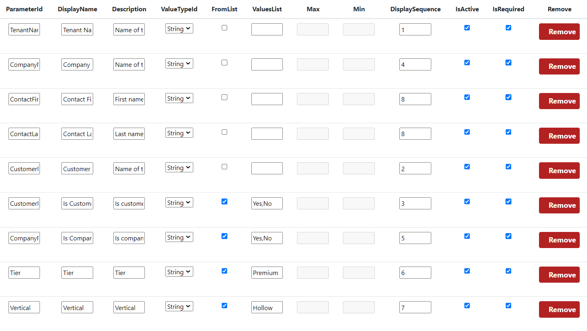
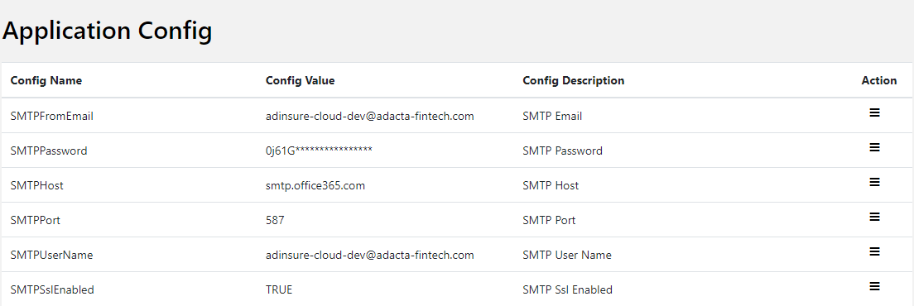

# Adacta - SaaS Accelerator Guidelines

## Links

- [Mastering the SaaS Accelerator](https://microsoft.github.io/Mastering-the-Marketplace/saas-accelerator/#setting-up-a-development-environment-for-the-saas-accelerator)
- [Setting up a development environment for the SaaS Accelerator - VIDEO](https://go.microsoft.com/fwlink/?linkid=2224222) - this is the video from the link above, but it is important so it is explicitly listed here.

## Warnings

- Reserved `WebAppNamePredix` values are: `adi-sa-kv` (prod), `adi-dev-sa-kv` (preprod).
- Reserved `ResourceGroupForDeployment` values are: `rg-saas-accelerator` (prod), `rg-saas-accelerator-dev` (preprod).
- AZ user that executes deployment should have permission to set policy on AdInsure Cloud KeyVault, that will grant `get` and `list` permission to secrets to Customer and Admin portal identities.
- AZ user should have permission to create App Registration on the tenant's AZ AD.

## Installation

Execute command with following parameters:

### Dev Installation

TBD

### Preprod Installation

> **Note:** Has `-dev` in the name. Unfortunately sometimes as suffix, sometimes in the middle.

```bash
wget https://dotnet.microsoft.com/download/dotnet/scripts/v1/dotnet-install.sh; `
chmod +x dotnet-install.sh; `
./dotnet-install.sh; `
$ENV:PATH="$HOME/.dotnet:$ENV:PATH"; `
dotnet tool install --global dotnet-ef; `
git clone https://github.com/adactafintech/saas-accelerator.git -b adacta-setup-01 --depth 1; `
cd ./saas-accelerator/deployment; `
.\Deploy.ps1 `
 -WebAppNamePrefix "adi-dev-sa" `
 -ResourceGroupForDeployment "rg-saas-accelerator-dev" `
 -PublisherAdminUsers "igor.mileusnic@adacta-fintech.com,jernej.kladnik@adacta-fintech.com" `
 -ProvisionAPIBaseURL "https://git.adacta-fintech.com/api/v4/projects/668/trigger/pipeline" `
 -ProvisionBranch "saas-env/prerelease" `
 -AdiCloudKeyVaultName "adisaasprovprerelease" `
 -ProvisionTokenSecretName "cloud-ci-trigger-token" `
 -ProvisionWebHookTokenSecretName "cloud-sa-webhook-token" `
 -Location "West Europe" 
```

After deployment, you should [configure SaaS Accelerator](#configuration). This step is common for all environments.

### Prod Installation

```bash
wget https://dotnet.microsoft.com/download/dotnet/scripts/v1/dotnet-install.sh; `
chmod +x dotnet-install.sh; `
./dotnet-install.sh; `
$ENV:PATH="$HOME/.dotnet:$ENV:PATH"; `
dotnet tool install --global dotnet-ef; `
git clone https://github.com/adactafintech/saas-accelerator.git -b adacta-setup-01 --depth 1; `
cd ./saas-accelerator/deployment; `
.\Deploy.ps1 `
 -WebAppNamePrefix "adi-sa" `
 -ResourceGroupForDeployment "rg-saas-accelerator" `
 -PublisherAdminUsers "igor.mileusnic@adacta-fintech.com,jernej.kladnik@adacta-fintech.com" `
 -ProvisionAPIBaseURL "https://git.adacta-fintech.com/api/v4/projects/668/trigger/pipeline" `
 -ProvisionBranch "saas-env/release" `
 -AdiCloudKeyVaultName "adisaasprovrelease" `
 -ProvisionTokenSecretName "cloud-ci-trigger-token" `
 -ProvisionWebHookTokenSecretName "cloud-sa-webhook-token" `
 -Location "West Europe" 
```

After deployment, you should [configure SaaS Accelerator](#configuration). This step is common for all environments.

## Infrastructure Installation

### Application Insights

1. Create single Log Analytics Workspace for one environment (for DEV one, for PROD one). Name it with suffix `-law` (e.g. `adi-sa-law`).
2. Create Application Insight for Admin app named like `adi-sa-admin-ai` (just add `-dev` if DEV environment). Point it to previously created Log Analytics Workspace.
3. Create Application Insight for Customer app named like `adi-sa-portal-ai` (just add `-dev` if DEV environment). Point it to previously created Log Analytics Workspace.

### Availability Test

TBD

## Configuration

### Configure AZ Marketplace

1. Open AZ Marketplace
2. Open SaaS offer that you want to connect with SaaS Accelerator.
3. Open `Technical Configuration` page from the menu.
4. In four input fields enter four output values that `Deploy.ps1` provided at the end. If you lost these values, please check [Troubleshooting](#troubleshooting) section for instructions how to find them.
5. Review and Publish the offer.

### Configure SaaS Accelerator

#### Configure Custom Fields

> **Note:** To be able to do this, you have to have at least one Offer in AZ Marketplace that is connected with this SaaS Accelerator.

1. Open Admin application
2. Open Offer page from the main menu.
3. Select Offer that you want to configure.
4. Add following fields (`TenantName`, `CompanyName`, `ContactFirstName`, `ContactLastName`) 
5. Save changes on the offer.
6. Open Plan page from the main menu.
7. Select Plan that is related to the previously configured offer.
8. Mark all properties on the plan to be `Enable`.
9. Save changes on the plan.

#### Configure Events

TBD

#### Configure Email

Configure SMPT settings:

1. Open Admin application.
2. Open Settings page from the main menu.
3. In Application Config set values (one by one) as it is on the screenshot 
4. Preproduction pass = "0j61GT7Se5rp8R5z7Jjt", Prod pass = "S^7uAWh5*^f7jM1V"

Configure events on plans:

1. Open Admin application.
2. Open Plans page from the main menu.
3. Select Edit option on the plan you want to configure (all should be configured).
4. Select Events tab.
5. Add email addresses into all events.
6. Activate all events.

#### Configure Admins

> **Note:** As parameters of the `Deploy.ps1` you specified list of admins. If you need to change that open Admin app and in Settings correct list of admin emails.

### Configure GitLab

#### Configure Webhook

TBD

## Upgrade

### Dev Upgrade

TBD

### Preprod Upgrade

```bash
wget https://dotnet.microsoft.com/download/dotnet/scripts/v1/dotnet-install.sh; `
chmod +x dotnet-install.sh; `
./dotnet-install.sh; `
$ENV:PATH="$HOME/.dotnet:$ENV:PATH"; `
dotnet tool install --global dotnet-ef; `
git clone https://github.com/adactafintech/saas-accelerator.git -b adacta-setup-01 --depth 1; `
cd ./saas-accelerator/deployment; `
.\Upgrade.ps1 `
 -WebAppNamePrefix "adi-dev-sa" `
 -ResourceGroupForDeployment "rg-saas-accelerator-dev"
```

### Prod Upgrade

```bash
wget https://dotnet.microsoft.com/download/dotnet/scripts/v1/dotnet-install.sh; `
chmod +x dotnet-install.sh; `
./dotnet-install.sh; `
$ENV:PATH="$HOME/.dotnet:$ENV:PATH"; `
dotnet tool install --global dotnet-ef; `
git clone https://github.com/adactafintech/saas-accelerator.git -b adacta-setup-01 --depth 1; `
cd ./saas-accelerator/deployment; `
.\Upgrade.ps1 `
 -WebAppNamePrefix "adi-sa" `
 -ResourceGroupForDeployment "rg-saas-accelerator"
```

## Deletion

Deletion of Azure resources:

1. Delete resource group (e.g. `rg-saas-accelerator-dev`)
2. Purge keyvault (it is soft-deleted within resource group) with command: `az keyvault purge --name <keyvault-name` (e.g. `adi-dev-sa-kv`, `adi-sa-kv`).
3. Delete two app registrations.

Deletion of your Azure Web Console:

1. Delete `./saas-accelerator` folder in the `home/<username>` folder of Azure Web Console.
2. Delete `./dotnet*` file(s) in the `home/<username>` folder of Azure Web Console.

<!-- ### Dev Deletion

TBD

### Preprod Deletion

```bash
# wget https://dotnet.microsoft.com/download/dotnet/scripts/v1/dotnet-install.sh; `
# chmod +x dotnet-install.sh; `
# ./dotnet-install.sh; `
# $ENV:PATH="$HOME/.dotnet:$ENV:PATH"; `
# dotnet tool install --global dotnet-ef; `
git clone https://github.com/adactafintech/saas-accelerator.git -b adacta-setup-01 --depth 1; `
cd ./saas-accelerator/deployment; `
.\Cleanup.ps1 `
 -WebAppNamePrefix "adi-dev-sa" `
 -ResourceGroupForDeployment "rg-saas-accelerator-dev"
```

### Prod Deletion

TBD -->

## Troubleshooting

- Deployment script hands on step `Create Sql Server` and eventually timed out.
  - Perform Deletion of all resources, and try again.
  - Deletion of resource group might fail because SQL Server cannot be deleted.
  - Try again, and again.
  > **Note:** If you find solution for failing SQL Server creation or deletion after it, please update here.
- Deployment fails because KeyVault cannot be created, since one already exists with the same name. - You did not purge KeyVault after last deletion of resource group.
- Deploy succeeded, but you did not write down data that scripts outputs and that you need to enter in AZ Marketplace in Technical Details of the offer.
  - `Landing Page section` can be found by:
    - Open Azure portal (https://portal.azure.com/)
    - Find resource group of the SaaS Accelerator
    - Find and open App Service with the name that has as suffix `-portal`
    - On App Service details page click `Browse` button.
    - URL that is opened is the URL that you need. Should be in the format `https://adi-dev-sa-portal.azurewebsites.net/`.
  - `Connection Webhook section` can be found by:
    - Open Azure portal (https://portal.azure.com/)
    - Find resource group of the SaaS Accelerator
    - Find and open App Service with the name that has as suffix `-admin`
    - On App Service details page click `Browse` button.
    - URL that is opened is the URL that you need, but with the suffix, and it should be in the format `https://adi-dev-sa-portal.azurewebsites.net/api/AzureWebhook`.
  - `Tenant ID` can be found by:
    - Open Azure portal (https://portal.azure.com/)
    - In the main menu open `Azure Active Directory`.
    - In the Azure Active Directory page check `Tenant ID`.
  - `AAD Application ID section` can be found by:
    - Open Azure portal (https://portal.azure.com/)
    - In the search type `App registrations`
    - Among app registrations find the one that has prefix same as `WebAppNamePrefix` of your deployment and suffix is `FulfillmentAppReg`.
    - For this app registration copy value in column `Application (client) ID`.

## Appendix

### Preprod Technical Details

➡️ Landing Page section:       https://adi-dev-sa-portal.azurewebsites.net/

➡️ Connection Webhook section: https://adi-dev-sa-portal.azurewebsites.net/api/AzureWebhook

➡️ Tenant ID:                  cdeb9156-219a-49e3-b414-f63acd298e9c

➡️ AAD Application ID section: 0c80fe88-6253-432a-b6d7-63d1b5f4842d

### Prod Technical Details

➡️ Landing Page section:       https://adi-sa-portal.azurewebsites.net/

➡️ Connection Webhook section: https://adi-sa-portal.azurewebsites.net/api/AzureWebhook

➡️ Tenant ID:                  cdeb9156-219a-49e3-b414-f63acd298e9c

➡️ AAD Application ID section: 254acb11-7727-4db4-a58c-1a4fee74928d

### Preprod App Configuration

```json
  {
     "name": "SaaSApiConfiguration__ProvisionAPIBaseURL",
     "value": "https://git.adacta-fintech.com/api/v4/projects/668/trigger/pipeline",
     "slotSetting": false
   },
   {
     "name": "SaaSApiConfiguration__ProvisionBranch",
     "value": "saas-env/prerelease",
     "slotSetting": false
   },
   {
     "name": "SaaSApiConfiguration__ProvisionToken",
     "value": "glptt-0f7d1aad5bd44c804701c630cd02917d4659892e",
     <!-- "value": "@Microsoft.KeyVault(VaultName=adi-dev-sa-kv;SecretName=ADApplicationSecret)"
adisaasprov    cloud-ci-trigger-token-dev -->
     "slotSetting": false
   },
   {
     "name": "SaaSApiConfiguration__ProvisionWebHookToken",
     "value": "ac64baa3ad9884ahe493dfc6kb9077",
     "slotSetting": false
   },
```

### Prod App Configuration

```json
 {
     "name": "SaaSApiConfiguration__ProvisionAPIBaseUrl",
     "value": "https://git.adacta-fintech.com/api/v4/projects/668/trigger/pipeline",
     "slotSetting": false
   },
   {
     "name": "SaaSApiConfiguration__ProvisionBranch",
     "value": "saas-env/release",
     "slotSetting": false
   },
   {
     "name": "SaaSApiConfiguration__ProvisionToken",
     "value": "glptt-85f9d6c763b4f7075085c9500cbd7de126518661",
     "value": "@Microsoft.KeyVault(VaultName=adi-dev-sa-kv;SecretName=ADApplicationSecret)"
adisaasprov     cloud-ci-trigger-token
     "slotSetting": false
   },
   {
     "name": "SaaSApiConfiguration__ProvisionWebHookToken",
     "value": "bc63b143ad9ae4ahe793dfa4kb9d37",
     "slotSetting": false
   },
```

### AZ Offer - Notes for Certification

AdInsure Cloud for Life represents SaaS offering for insurance companies that have in their portfolio Life insurance.

For testing purpose, plan "AdInsure Cloud for Life TEST" should be used.

A client that subscribes to AdInsure Cloud for Life will be forwarded to the Landing page of AdInsure Cloud.
The client will be asked to enter the following information:
- Tenant Name - string value that will be the prefix of the DNS entry of the to-be provisioned AdInsure Cloud tenant. Validation of this value is only that it is unique (not already used) in the Cloud.
- Company Name - string value for easier support.
- Contact First Name - string value for easier support.
- Contact Last Name - string value for easier support.

After entering data on the Landing page, the client should press Subscribe button, and go to the Subscriptions page.
On the Subscriptions page will be visible new subscription that client created.
Subscription will be in status "Pending Activation", till Adacta team does not provision new tenant for this subscription.

Provisioning process, on Adacta side, is automated, but it requires manual review of the subscription request and manual approval.
When Admin approves subscription request in Admin application, provisioning is happening automatically within one hour (max).
When the provisioning finishes following happens:
- Client can see in Customer portal's Subscriptions page the subscription with status Activated.
- Client will see in AZ Portal under SaaS its subscription in Activated status.
- Client will be able to access tenant's entry page in browser on address `<entered-tenant-name>.adinsure.adacta-fintech.com`

When the client does not want to use AdInsure Cloud for Life anymore, it is possible to unsubscribe in one of the following ways:
- On Customer portal, open Subscriptions page, and select Unsubscribe option on the subscription.
- On AZ Portal, under SaaS, select Unsubscribe on the subscription.

If unsubscribing is done on Customer portal, then 

